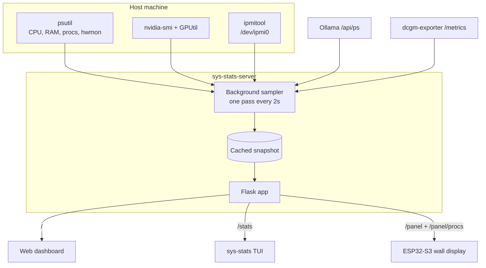

# 📊 sys-stats


[](https://github.com/obeone/sys-stats/actions/workflows/build-and-publish.yaml)

Real-time system, GPU and Ollama monitoring for a single machine, with a web
dashboard, a terminal dashboard, and a compact JSON endpoint for an embedded
wall display.

One process collects everything (CPU, RAM, swap, load, per-core usage,
temperatures, fans, NVIDIA GPUs, per-process CPU/RAM/VRAM, loaded Ollama
models) in a background sampler and serves it over HTTP. Every dashboard is a
client of that API, not a second collector, so you can watch a remote host
from your laptop, from a browser or from a terminal.

---

## 🚀 Features

| Feature | What it does |
| --- | --- |
| 🖥️ Web dashboard | Auto-refreshing UI at `/`, no build step and no JS dependencies |
| 📺 Terminal dashboard | Rich TUI with focus, zoom, scrolling and adjustable refresh |
| 🎮 GPU monitoring | Load, VRAM, temperature, fan speed, power draw, per-process VRAM |
| 🤖 Ollama integration | Loaded models with their VRAM footprint and context window |
| 🌡️ Sensors | hwmon temperatures and fans, plus IPMI sensors on chassis with a BMC |
| 📟 Embedded panel | `/panel`, a frozen-schema payload sized for an ESP32-S3 wall display |
| 🐳 Deployment | Multi-arch image, Compose overlays, and a Helm chart for Kubernetes |

---

## ⚡ Quickstart

```bash
docker run -d --pid=host -p 5000:5000 ghcr.io/obeone/sys-stats:1.7.0
```

Open <http://localhost:5000>.

`--pid=host` is what makes the process tables meaningful. Without it the
container sees exactly one process, its own. No privileged flag is needed.

On macOS, port 5000 belongs to the AirPlay Receiver. Publish on another port
(`-p 5051:5000`) or turn AirPlay off.

---

## 📦 Installation

Two console scripts come with the package, whichever way you install it:

| Command | Purpose |
| --- | --- |
| `sys-stats-server` | Flask metrics API and web UI, serves `/`, `/stats`, `/panel` and `/panel/procs` |
| `sys-stats` | Rich terminal dashboard, an HTTP client of `/stats` |

`python -m sys_stats` is an alias for the CLI.

### With uv (recommended)

[`uv`](https://docs.astral.sh/uv/) is the fastest option and keeps the tool in
its own environment:

```bash
uv tool install git+https://github.com/obeone/sys-stats.git
```

Upgrade with `uv tool upgrade sys-stats`, remove with
`uv tool uninstall sys-stats`. To run it once without installing anything
permanent:

```bash
uvx --from git+https://github.com/obeone/sys-stats.git sys-stats
```

### With pipx

```bash
pipx install git+https://github.com/obeone/sys-stats.git
```

Upgrade with `pipx upgrade sys-stats`, remove with `pipx uninstall sys-stats`.

### With pip

> ⚠️ **Do not run `pip install sys-stats`.** That name belongs to a different,
> unrelated project on PyPI, which also describes itself as serving system
> stats over a web interface, so installing it by mistake looks like success.
> This project is not published on PyPI under any name. Install it from git or
> from a checkout.

```bash
python3 -m venv .venv
source .venv/bin/activate          # Windows: .venv\Scripts\activate
pip install git+https://github.com/obeone/sys-stats.git
```

### From a local checkout, for development

```bash
git clone https://github.com/obeone/sys-stats.git
cd sys-stats
uv venv && source .venv/bin/activate
uv pip install -e '.[dev]'
```

---

## 🐳 Docker

```bash
git clone https://github.com/obeone/sys-stats.git
cd sys-stats
docker compose up -d
```

Overlays layer on top of `compose.yaml` for hardware the default cannot reach:

| Command | When |
| --- | --- |
| `docker compose up -d` | Any host. CPU, RAM, processes, hwmon sensors |
| `docker compose -f compose.yaml -f compose.gpu.yaml up -d` | NVIDIA GPU, through the NVIDIA container runtime |
| `docker compose -f compose.yaml -f compose.ipmi.yaml up -d` | Server with a BMC (Supermicro, Dell) for IPMI sensors |

Images are published on every release to `ghcr.io/obeone/sys-stats` and
`docker.io/obeoneorg/sys-stats`, for `linux/amd64` and `linux/arm64`, and
signed with cosign.

### What the container needs, and what it does not

The container runs unprivileged, as UID 10001, and that is enough for
everything except IPMI:

| Collector | Requirement |
| --- | --- |
| Processes, CPU, RAM, swap, load | `pid: host`. `/proc` is world-readable |
| hwmon temperatures and fans | Nothing. `/sys` is already mounted read-only |
| NVIDIA GPU | The NVIDIA container runtime, via `compose.gpu.yaml` |
| IPMI temperatures and fans | `/dev/ipmi0` mapped in, and root to open it |

`/dev/ipmi0` is `root:root 0600` on every distribution that ships it, so
`compose.ipmi.yaml` runs as root. Where host udev rules give the device a
group, prefer `group_add` with that GID and keep the unprivileged user; the
overlay documents both.

---

## ☸️ Kubernetes

[`chart/`](chart/) is a Helm chart built on the
[bjw-s common library](https://github.com/bjw-s-labs/helm-charts):

```bash
helm dependency update chart/
helm upgrade --install sys-stats ./chart --namespace monitoring --create-namespace
```

The dashboard reports on the node the pod lands on, so the chart defaults to
`hostPID: true`, without which the process tables are empty. The container
itself runs unprivileged, with `capabilities.drop: [ALL]`.

Pin the pod to the machine you actually want to watch, claim a GPU if you want
the NVIDIA panels, and point `OLLAMA_API_URL` somewhere for the Ollama one.
[`chart/values.yaml`](chart/values.yaml) documents all three, along with the
commented block for IPMI, which does need a privileged pod on Kubernetes since
there is no per-device request for a BMC.

---

## 🖼️ Screenshots


---

## ⚙️ Configuration

Everything is an environment variable. Nothing is required.

### Server

| Variable | Default | Effect |
| --- | --- | --- |
| `HOST` / `PORT` | `0.0.0.0:5000` | Bind address |
| `FLASK_DEBUG` | `false` | `true` enables Flask debug mode |
| `OLLAMA_API_URL` | unset | Enables the Ollama panel; unset means an empty model list, never an error |
| `SYS_STATS_INSTANCE_LABEL` | unset | Free-text label in the web UI title and body |
| `SYS_STATS_PANEL_ONLY` | unset | `1`/`true`/`yes` registers only `/panel` and `/panel/procs` |

### Sampler

| Variable | Default | Effect |
| --- | --- | --- |
| `SYS_STATS_SAMPLE_INTERVAL` | `2.0` | Seconds between samples |
| `SYS_STATS_TOP_PROCESSES_MAX` | `50` | Cap per per-process ranking |
| `SYS_STATS_IPMI_INTERVAL` | `30.0` | Seconds between `ipmitool` polls |
| `SYS_STATS_DCGM_URL` | unset | Scrape `/panel`'s GPUs from dcgm-exporter |
| `SYS_STATS_AUTOSTART` | on | `0`/`false`/`no` skips the sampler autostart |

### Panel

| Variable | Default | Effect |
| --- | --- | --- |
| `SYS_STATS_HOSTNAME` | real hostname | Overrides `/panel`'s `host` field |
| `SYS_STATS_PANEL_MAX_TEMPS` | no cap | Truncates `/panel`'s `temps` list |
| `SYS_STATS_PANEL_MAX_FANS` | no cap | Truncates `/panel`'s `fans` list |
| `SYS_STATS_PANEL_MAX_GPUS` | no cap | Truncates `/panel`'s `gpu` list |

### CLI

| Variable | Default | Effect |
| --- | --- | --- |
| `SYS_STATS_API_URL` | `http://localhost:5000/stats` | Default `--url` |

### The ones with a real story behind them

**`SYS_STATS_PANEL_ONLY` is security-relevant.** `/stats` exposes the full
host process table, complete command lines included, with no authentication.
Set this and `/`, `/stats` and `/favicon.png` are never registered at all, so
a request gets Flask's own 404 rather than a guarded rejection. On a host
whose network you do not fully trust, and where the consumer only ever needs
`/panel`, removing the route beats guarding it. `/panel/procs` stays
registered in this mode, since it carries process names and figures but never
a command line. The Helm chart's default
probes hit `/`, so enabling this there means repointing them at `/panel`.

**`SYS_STATS_HOSTNAME` and `SYS_STATS_INSTANCE_LABEL` are not the same thing**
and are never merged. The label is display prose, meant to be rewritten for
readability, for telling apart two instances describing the same physical box
(a Kubernetes pod seeing the Talos VM, and a second instance on the Proxmox
hypervisor underneath). The hostname is a machine identity a consumer compares
byte for byte, `/panel` only, and otherwise read fresh on every request so a
runtime rename takes effect without a restart.

**`SYS_STATS_DCGM_URL` is for a host with no NVIDIA driver of its own**, such
as a Proxmox hypervisor whose GPUs are PCI-passed-through to a Kubernetes VM
where [dcgm-exporter](https://github.com/NVIDIA/dcgm-exporter) runs instead.
It is scraped in the same sampling pass as everything else, behind a circuit
breaker, so a dead or firewalled endpoint degrades to an empty `gpu[]` with a
`"gpu"` tag in `err` rather than stalling the sampler. `/stats` never reads
it and always stays on the GPUtil path.

**`SYS_STATS_IPMI_INTERVAL` is decoupled from the sample interval** because
chassis fan speed and temperature move on a timescale of tens of seconds, and
each poll costs a BMC round trip. Between polls the lists keep serving the
last IPMI reading rather than dropping it; the first pass after startup always
polls immediately. hwmon sensors keep the normal per-pass cadence.

---

## 📺 Using the terminal dashboard

```bash
sys-stats --url http://localhost:5000/stats --interval 5
```

Every panel carries a number in its title, and a one line key helper is pinned
at the bottom. Press `h` for the full list.

| Key | Action |
| --- | --- |
| `q` / `r` | Quit, force a refresh |
| `p` / `-` / `+` | Pause, slow down, speed up |
| `1`..`9` | Focus the panel carrying that number |
| `Tab` / `Shift+Tab` | Focus the next or previous panel |
| `Enter` / `Esc` | Zoom the focused panel full screen, and come back |
| arrows, `PgUp`/`PgDn`, `Home`/`End` | Scroll the focused panel |

A panel that cannot show every row says how many it is hiding, so a busy host
never drops rows silently. A zoomed panel keeps refreshing and keeps scrolling.

The layout follows the terminal: a wide one gets a row of columns, a narrower
one falls back to a grid, and panels stop where their content stops instead of
framing empty space. On a machine with several GPUs the summary keeps cumulated
figures, each card gets its own detail table (or one row per card when they no
longer fit side by side), and the GPU process list says which card each process
is holding VRAM on.

---

## 🔌 API

| Route | Returns |
| --- | --- |
| `GET /` | The web dashboard |
| `GET /stats` | Full JSON payload: CPU, RAM, GPUs, top processes, Ollama models |
| `GET /panel` | Compact frozen-schema payload for an embedded display |
| `GET /panel/procs` | Process lists and Ollama models, names and figures only |
| `GET /favicon.png` | Icon |

`/stats` takes an optional `?limit=` for the per-process rankings, capped by
`SYS_STATS_TOP_PROCESSES_MAX`.

`/panel` carries no process lists and no Ollama data, just CPU, RAM, swap, GPU
and sensor numbers, plus an `age` in seconds telling the display how stale the
sample is. It shares the same sampling pass as `/stats`, so enabling it costs
no extra `nvidia-smi` call. Its schema is frozen on purpose: a wall display
flashed once should not need reflashing when the dashboard gains a field.

`/panel/procs` is where the display gets its process lists instead. It returns
`top_cpu`, `top_memory`, `top_gpu_processes` and `ollama_processes` with the
same nesting and the same `?limit=` handling as `/stats`, but each entry is
rebuilt from an allowlist: `pid`, `name` and the one figure the ranking is
about (`cpu_percent`, `memory_usage`, or `memory_used` plus `gpu_index`), and
`name`, `model`, `size_vram` and `size` for Ollama models. No command line
ever leaves, which is why it is still served under `SYS_STATS_PANEL_ONLY`. It
reads the same cached sample as `/stats`, so it costs no extra process sweep.

Both routes read a cached snapshot. No request ever collects anything itself.

---

## 🛠️ Development

```bash
uv venv && source .venv/bin/activate
uv pip install -e '.[dev]'
```

| Command | Purpose |
| --- | --- |
| `pytest` | Whole suite |
| `pytest tests/test_stats_endpoint.py` | One file |
| `pytest -k gpu_processes` | One test or group |
| `ruff check .` | Lint, add `--fix` to autofix |
| `uv build` | Wheel and sdist in `dist/` |
| `docker compose up -d --build` | Rebuild the image and restart |

No test touches the real machine: `psutil`, `GPUtil`, `subprocess.run` and
`requests.get` are all monkeypatched at the `sys_stats.collectors` boundary.

The version lives in git tags and nowhere else: hatch-vcs derives it, so a
build on `v1.6.0` is `1.6.0` and three commits later it is
`1.6.1.dev3+g<sha>`. A tree with no tags in it, a shallow clone or an
unpacked source tarball, has nothing to derive from and needs
`SETUPTOOLS_SCM_PRETEND_VERSION=X.Y.Z` to build at all.

Releasing is one push:

```bash
git tag v1.6.0 && git push origin v1.6.0
```

That runs the tests, publishes `:1.6.0` and `:latest` to both registries,
opens the GitHub release with its generated changelog, and commits the new
image tag into `compose.yaml`, this README and the chart.

---

## 🏗️ Architecture



Every collector degrades to empty data rather than raising, so a missing GPU,
a dead Ollama or a host with no BMC costs you a blank panel, never a 500.

---

## 🧑‍💻 Contributing

Issues, feature suggestions and pull requests are all welcome.

This repo is clearly messy, but it was supposed to be only for my own use!

---

## 📝 License

MIT. See [LICENSE](LICENSE).

Made by Grégoire Compagnon (obeone)
